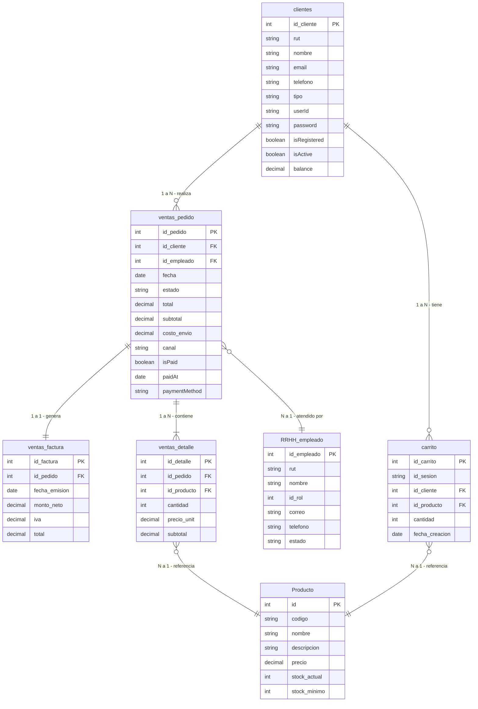

## Cómo ejecutar el proyecto

### Requisitos previos
- [Node.js](https://nodejs.org/) v18 o superior
- [Docker](https://www.docker.com/) y Docker Compose
- Acceso a la base de datos **Neon PostgreSQL (si2)**

---

### Backend (NestJS)

#### Opción A — Con Docker (recomendado)

El backend se conecta directamente a Neon (no levanta PostgreSQL local):

```bash
cd CorvamiStore/Backend/corvami-backend
docker-compose up --build
```

El API quedará disponible en `http://localhost:3000`.


#### Opción B — Sin Docker (desarrollo local)

Instala dependencias y levanta en modo desarrollo:

```bash
cd CorvamiStore/Backend/corvami-backend
npm install
npm run start:dev
```

El API quedará disponible en `http://localhost:3000`.

-**Documentación Swagger:** `http://localhost:3000/api/docs`

---

```bash
cd CorvamiStore/Frontend/corvami-frontend
npm install
npm run dev
```

La aplicación quedará disponible en `http://localhost:5173`.

---

### Variables de entorno (Backend)

Crea un archivo `.env` en `Backend/corvami-backend/` con las siguientes variables si no usas Docker:

```env
# Neon PostgreSQL — conexión principal (schema: Ventas)
DB_HOST=ep-royal-glade-ac55fitc-pooler.sa-east-1.aws.neon.tech
DB_PORT=5432
DB_USER=neondb_owner
DB_PASSWORD=<tu_contraseña>
DB_NAME=si2
DB_SCHEMA=Ventas

# Auth
JWT_SECRET=corvami-secret-key-2024

# Email (opcional)
EMAIL_USER=tu_correo@gmail.com
EMAIL_PASSWORD=tu_app_password
```

> **Nota:** Ambas conexiones TypeORM (`default` y `external`) apuntan a la misma base Neon si2.
> - Conexión `default` → schema `Ventas` (tablas propias, `synchronize: false`)
> - Conexión `external` → schemas `Inventario` y `RRHH` (**solo lectura**, `synchronize: false`)

---

## Modelo de base de datos

> **Cardinalidad:** `||` = exactamente 1 · `o{` = 0 o muchos · `|{` = 1 o muchos · `}o` = muchos a 1



| Notación flecha | Cardinalidad |
|-----------------|--------------|
| `\|\|--\|\|`   | 1 a 1 exacto |
| `\|\|--\|{`    | 1 a N (mínimo 1) |
| `\|\|--o{`     | 1 a 0..N (puede ser cero) |
| `}o--\|\|`     | N a 1 |